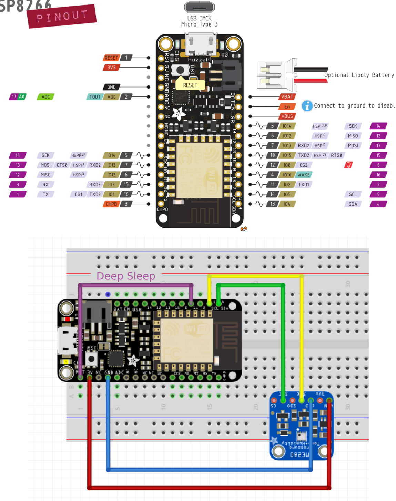

# Bain

Bain is a DIY wireless thermometer. It is made of two parts:

- [Adafruit Feather HUZZAH with ESP8266](https://www.adafruit.com/product/2821): it's an Arduino compatible board that has WiFi capability and a connector to plug any Adafruit 3.7V Lithium polymer batteries.
- [Adafruit BME280 I2C or SPI](https://www.adafruit.com/product/2652): It's an environmental sensor with temperature, barometric pressure and humidity from Bosch.

This repository contains all the instructions to build the thermometer yourself.

Features:

- Monitor temperature, pressure and humidity.
- Generated data are sent to a custom MQTT broker as a JSON string.
- Time is syncronized every 6h with NTP and the timezone can be set.
- A timestamp string is added to sensor data before they are sent.
- Deep sleep mode can be enabled to reduce power consumption. A standard battery of [1200 mAh](https://www.adafruit.com/product/258) can last few weeks/months (**Warning:** This still needs to be verified).
- Monitor battery level (optional).
- The source code is profusely commented and factorized. It should be easily to adapt to your needs.

## Instructions

### Assembly on a breadboard

Follow the connections shown below. There is 4 connections (blue, red, yellow and green) in between the Feather ESP8266 board the BME280 chip. And also a last connection in purple to enable deep sleep mode and reduce battery consumption. **Warning:** Apparently, the Feather ESP8266 chip can't be flashed with the purple connection so you have to disconnect it, then flash and then reconnect it.



### Flash the controller

I suggest you to use the [Arduino IDE](https://www.arduino.cc/en/main/software) to flash the controller to the board. Note that [a VSCode extension for Arduino IDE](https://marketplace.visualstudio.com/items?itemName=vsciot-vscode.vscode-arduino) is also available.

You need to add the following URL to the **Arduino Board Manager**: `http://arduino.esp8266.com/stable/package_esp8266com_index.json`.

Then in the **Arduino Board Manager**, install the `ESP8266` package. After this, you should be able to select the correct board from the **Board Manager**: `Adafruit Feather HUZZAH ESP8266`.

You also need to install the following Arduino libraries (use the **Arduino Library Manager**):

- [Adafruit ESP8266](https://github.com/adafruit/Adafruit_ESP8266): Arduino board with WiFi capability.
- [Adafruit BME280 Library](https://github.com/adafruit/Adafruit_BME280_Library): Sensor library.
- [Adafruit Unified Sensor](https://github.com/adafruit/Adafruit_Sensor): Needed for Adafruit BME280 Library.
- [ArduinoJson](https://github.com/bblanchon/ArduinoJson): a JSON library. **Warning**: as of today (06/02/2019), you should install version 5 only and not version 6.
- [NTPClient](https://github.com/arduino-libraries/NTPClient): an NTP client library to get date and time.
- [PubSubClient](https://github.com/knolleary/pubsubclient): MQTT Client. This library has been integrated into the source code since the `MQTT_MAX_PACKET_SIZE` variable must be increased to `512` ([commit used](https://github.com/knolleary/pubsubclient/tree/26ce89fa476da85399b736f885274d67676dacb8)).

Set secret parameters:

- Copy `bain/secret.h.template` to `bain/secret.h`.
- Edit `bain/secret.h` to set WiFi and MQTT parameters.

Set also common parameters in `bain/parameters.h`. Here you can for example disable or enable deep sleep mode.

Now you're ready to flash your ESP8266 controller.

- From you Arduino editor, open [`bain/bain.ino`](bain/bain.ino).
- Compile it.
- After connecting the ESP8266 board to your computer, upload the controller.

By reading on the serial port, you should see some log and also the JSON string sent to the MQTT broker:

```json
{
  "temperature": 25.23,
  "pressure": 1018.4,
  "humidty": 90.12,
  "timestamp": "2019-02-15 15:45:23",
  "batteryLevel": "",
  "batteryCharging": "",
  "batteryVoltage": ""
}
```

### Final Assembly

Once you've checked that everything works you can assemble everything together using a [FeatherWing proto board](https://www.adafruit.com/product/2884).

### Battery Level Monitoring

**NOTE: Work In Progress.**

If you want to monitor the LiPo battery level, you need to add some connections to your circuit as below. For this you need the following parts:

- 1 x 10kΩ resistor
- 1 x 48kΩ resistor
- 1 x 1MΩ resistor
- 1 x 1µF capacitor

TODO: add drawing.

Then you need to set `monitorBattery` to `true` in `parameters.h`. You can also read a LiPo battery level from any Huzzah ESP8266 board by flashing `utils/battery/battery.ino`.

*This setup comes from https://github.com/lobeck/adafruit-feather-huzzah-8266-battery-monitor.*

## Home Assistant

If you are using [Home Assistant](https://www.home-assistant.io) to retrieve the sensor values through an MQTT broker, here is the `sensor` configuration you can use:

```yaml
sensor:
  - platform: mqtt
    name: bain_sensor1_temperature
    state_topic: "/bain_sensor/1"
    unit_of_measurement: '°C'
    value_template: "{{ value_json.temperature }}"

  - platform: mqtt
    name: bain_sensor1_humidity
    state_topic: "/bain_sensor/1"
    unit_of_measurement: '%'
    value_template: "{{ value_json.humidity }}"

  - platform: mqtt
    name: bain_sensor1_pressure
    state_topic: "/bain_sensor/1"
    unit_of_measurement: 'hPa'
    value_template: "{{ value_json.pressure }}"
```

You can add more values from the JSON string if you want.

## License

[MIT](./LICENSE).

## Author

- [Hadrien Mary](mailto:hadrien.mary_AT_gmail.com)
