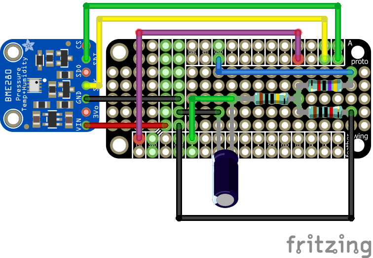

# Bain
[](https://travis-ci.com/hadim/bain)

A DIY IoT wireless sensor for temperature, humidity and pressure. It is made of two parts:

- [Adafruit Feather HUZZAH with ESP8266](https://www.adafruit.com/product/2821): it's an Arduino compatible board that has WiFi capability and a connector to plug any Adafruit 3.7V Lithium polymer batteries. Note that any ESP8266 board should work.
- [Adafruit BME280 I2C or SPI](https://www.adafruit.com/product/2652): It's an environmental sensor with temperature, barometric pressure and humidity from Bosch.

This repository contains all the instructions to build the Bain sensor yourself.

## Features

- 🌡 Monitor **temperature**, **pressure** and **humidity**.
- ✈ Data are sent to a custom **MQTT** broker as a **JSON** string.
- 🕕 **Time is syncronized** every 6h with NTP and the **timezone** can be specified.
- 😴 Deep sleep mode can be enabled to **reduce power consumption**. A standard LiPo battery of [1200 mAh](https://www.adafruit.com/product/258) can last about a week. Consumption is ~6.5mA while in deep sleep mode (optional).
- 🔋 Monitor **battery level** (optional).
- 💡 The source code is profusely commented and factorized. It should be **easy to adapt** to your needs.

## Instructions

### Assembly on a breadboard

Follow the connections shown below. There is 4 connections (blue, red, yellow and green) in between the Feather ESP8266 board the BME280 chip. And also a last connection in purple to enable deep sleep mode and reduce battery consumption (optional).

**Warning:** Apparently, the Feather ESP8266 chip can't be flashed with the purple connection so you have to disconnect it, then flash and then reconnect it.


### Flash the controller

#### Environement Setup

You should use the [Arduino IDE](https://www.arduino.cc/en/main/software) to flash the controller to the board. Note that [a VSCode extension for Arduino IDE](https://marketplace.visualstudio.com/items?itemName=vsciot-vscode.vscode-arduino) is also available and works well.

- You need to add the following URL to the **Arduino Board Manager**: `http://arduino.esp8266.com/stable/package_esp8266com_index.json`.

- Then in the **Arduino Board Manager**, install the `ESP8266` package. After this, you should be able to select the correct board from the **Board Manager**: `Adafruit Feather HUZZAH ESP8266`.

- Then you need to install the following Arduino libraries (use the **Arduino Library Manager**):

  - [Adafruit ESP8266](https://github.com/adafruit/Adafruit_ESP8266): Arduino board with WiFi capability.
  - [Adafruit BME280 Library](https://github.com/adafruit/Adafruit_BME280_Library): Sensor library.
  - [Adafruit Unified Sensor](https://github.com/adafruit/Adafruit_Sensor): Needed for Adafruit BME280 Library.
  - [ArduinoJson](https://github.com/bblanchon/ArduinoJson): a JSON library. **Warning**: as of today (06/02/2019), you should install version 5 only and not version 6.
  - [NTPClient](https://github.com/arduino-libraries/NTPClient): an NTP client library to get date and time.
  - [PubSubClient](https://github.com/knolleary/pubsubclient): MQTT Client. This library has been integrated into the source code since the `MQTT_MAX_PACKET_SIZE` variable must be increased to `512` ([commit used](https://github.com/knolleary/pubsubclient/tree/26ce89fa476da85399b736f885274d67676dacb8)).

#### Controller Configuration

- Configure WiFi and MQTT credentials:

  - Copy `bain/secret.h.template` to `bain/secret.h`.
  - Edit `bain/secret.h`.

```cpp
#ifndef BAIN_SECRET
#define BAIN_SECRET

#define WIFI_SSID "myssid"
#define WIFI_PASSWORD "mypassword"

#define MQTT_SERVER "your_server"
#define MQTT_PORT 1883
#define MQTT_CLIENT_ID "sensor1"
#define MQTT_MESSAGE_TOPIC "/bain_sensor/1"

// Leave blank to disable auth.
#define MQTT_USERNAME "your_username"
#define MQTT_PASSWORD "your_password"

#endif
```

- Configure other parameters by editing `bain/parameters.h`.

```cpp
#ifndef BAIN_PARAMETERS
#define BAIN_PARAMETERS

// Timezone
const int timeOffsetHours = -5;

// Delay between two measures in seconds.
const int loop_delay_s = 60;

// Enable deep sleep mode.
const boolean deep_sleep = true;

// Monitor battery level.
const boolean monitorBattery = true;

// LEDs. Disable by setting value to `-1`.
// Warning: Unused at the moment.
const int state_LED = -1;

#endif
```

#### Flash It!

Now you're ready to flash the controller.

- From you editor, open [`bain/bain.ino`](bain/bain.ino).
- Compile it.
- After connecting the board to your computer, upload the controller.

By reading on the serial port, you should see logging messages about WiFi, the sensor and also the JSON string sent to the MQTT broker:

```json
{
  "temperature": 25.23,
  "pressure": 1018.4,
  "humidty": 90.12,
  "timestamp": "2019-02-15 15:45:23",
  "batteryLevel": 82.3,
  "batteryCharging": false,
  "batteryVoltage": 3.76
}
```

### Battery Level Monitoring

If you want to monitor the LiPo battery level, you need to add some connections to your circuit as shown below. For this you need the following parts:

- 1 x 10 kΩ resistor
- 1 x 47 kΩ resistor
- 1 x 1 MΩ resistor
- 1 x 1 µF capacitor


Then you need to set `monitorBattery` to `true` in `bain/parameters.h`.

*This setup comes from https://github.com/lobeck/adafruit-feather-huzzah-8266-battery-monitor.*

### Final Assembly

Once you've checked your assembly works you can solder everything together using a [FeatherWing proto board](https://www.adafruit.com/product/2884). Here is the final assembly diagram:



## Case

**TODO.**

## Home Assistant

If you are using [Home Assistant](https://www.home-assistant.io) to retrieve the sensor values through an MQTT broker, here is the `sensor` configuration you can use:

```yaml
sensor:
  - platform: mqtt
    name: bain_sensor1_temperature
    state_topic: "/bain_sensor/1"
    unit_of_measurement: '°C'
    value_template: "{{ value_json.temperature }}"

  - platform: mqtt
    name: bain_sensor1_humidity
    state_topic: "/bain_sensor/1"
    unit_of_measurement: '%'
    value_template: "{{ value_json.humidity }}"

  - platform: mqtt
    name: bain_sensor1_pressure
    state_topic: "/bain_sensor/1"
    unit_of_measurement: 'hPa'
    value_template: "{{ value_json.pressure }}"
```

You can add more values from the JSON string if you want.

## License

[MIT](./LICENSE).

## Author

- [Hadrien Mary](mailto:hadrien.mary_AT_gmail.com)
